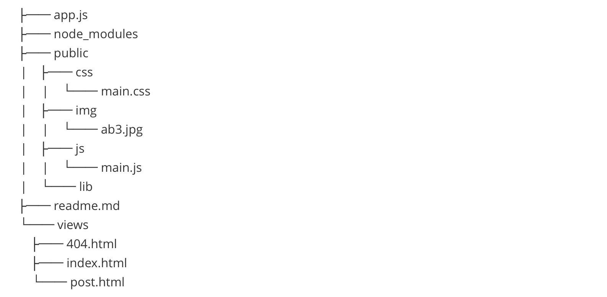
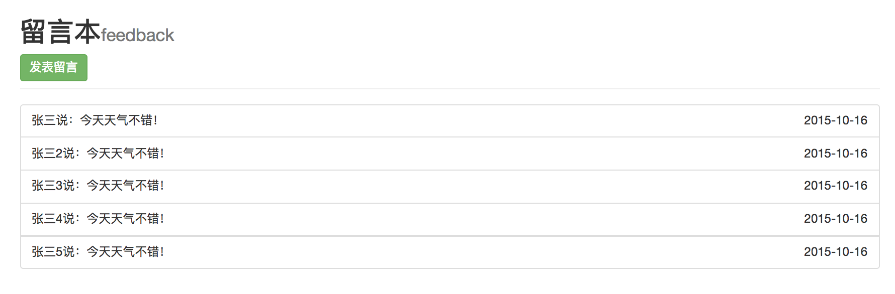
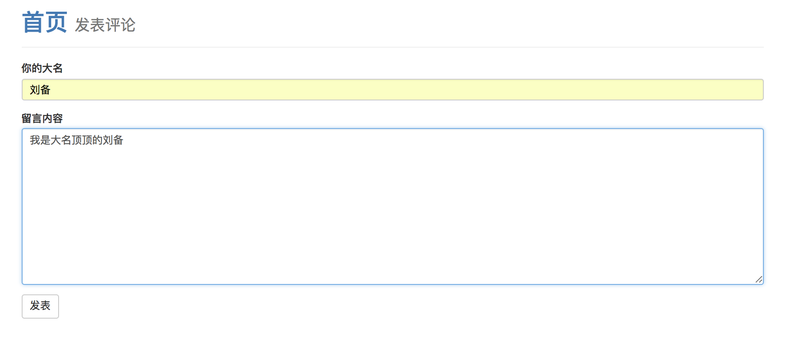
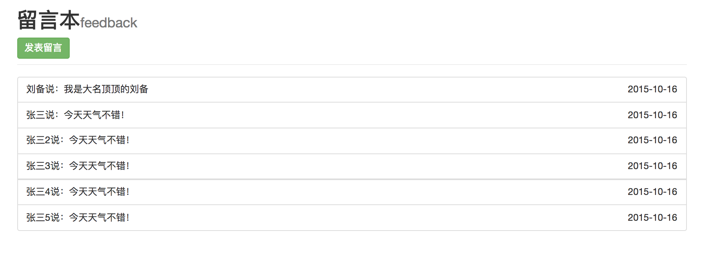

# 留言本(http模块创建的服务器)

1. ### 技术栈

   - ### Node

   - ### art-template模版

   - ### bootstrap

2. ### 项目结构

  
3. ### 实现功能

   - ### 评论页评论后跳转到首页

   - ### 评论追加到首页

4. ### 项目截图
   - ### 首页

   - ### 评论页

   - ### 评论后的首页
   
   
